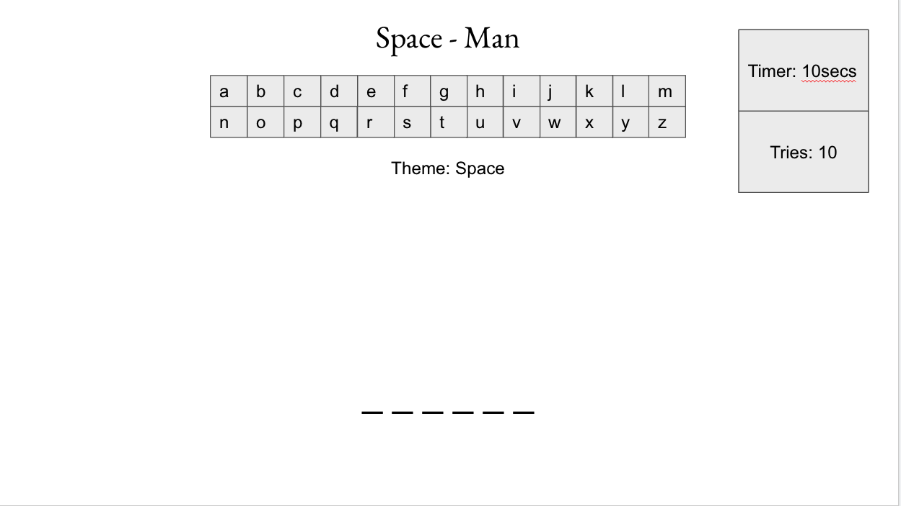
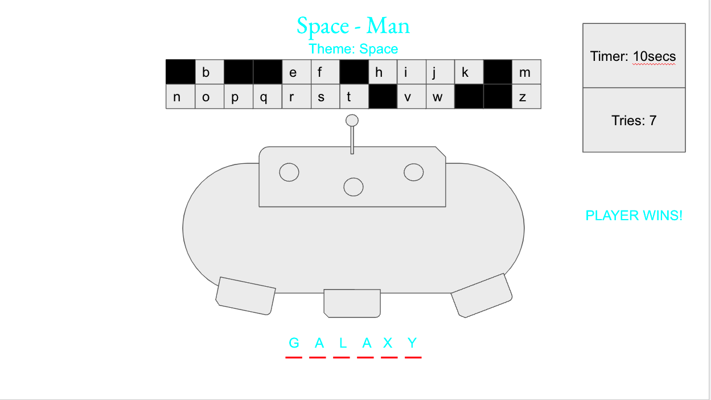

## Project Description

The game space-man is usually played in a group or with another person. The person chosen to has to think of a word in a certain category for the challengers. This is a game of right or wrong. You only have 6 tries to guess the word before the space-ship is built and flies away. You have the whole alphabet to guess through and once you guess that letter it is canceled out for the duration of the round. You're also on a timer every round of letter guessing to sweat your armpits trying to guess the letters of the word. If you get the word right, you are rewarded with street credits and a pat on the back. The challenger in this game has the choice of continuing or stopping the game right there. There's only so many rounds of words, but once you get to the end you will feel like a space-man/woman.

## What I used to develop this game:

Javascript,
HTML,
& CSS

## Installation Instructions

1. Fork and Clone in terminal 
2. Cd into folder space-man

## Review on self

What have I learned throughout this game?

What are the struggles that I encountered when I was making this game?

What was I most happy about when creating this game?

## Wire Frames

The Beginning

Game Plays

## User Stories

### MVP Goals

- As the player, I would like to know what the theme of the game is.
- As the player, I would like to know how many letters are in the word.
- As the player, I would like to see what letters I can choose from.
- As the player, I would like to know how many tries I have to guess the word that counts down when I guess.
- As the player, I would like a visual to the see the spaceship building every-time I get the letter wrong.
- As the player, I would like to see if I'm able to restart the game to restart my score.

### Stretch Goals

- As the player, I would like to click for a hint if I'm stuck.
- As the player, I would love a visual representation every-time I get the word right.
- As the player, I would love some space-music playing while I'm playing.
- As the player, I would love to see high-scores of everybody that has played the game and record my name into the list.
- As the player, I would like if I got the word right, it wouldn't restart my number of tries.
- As the player, I would like to see if I lose an animation of a space-ship flying off.
- As the player, I would like to see different themes switching every-time I guess the word right. 